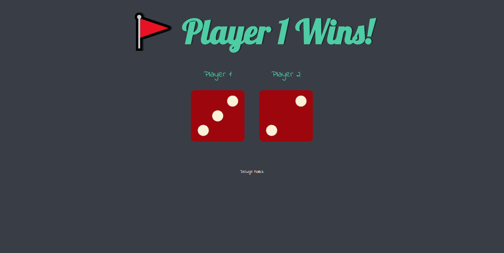

  

# Dicer

A Dice game which you can play with your friend

---

   

## Motivation

Create this website to apply basic concepts of JavaScript and help others to start their journey in Web Development.

## Screenshots

## Tech/ Framework Used

**Built with**

1. [HTML5](https://developer.mozilla.org/en-US/docs/Web/HTML)
1. [CSS3](https://developer.mozilla.org/en-US/docs/Web/CSS)
1. [JavaScript](https://developer.mozilla.org/en-US/docs/Web/javascript)

## How to use?

If you want to use the website just go to this [link](https://dicerr.netlify.app/)

- It's a two player game.
- Each player have one dice which generate a random number from 1 to 6.
- Each time you refresh the page the dices generate some random numbers and one with the higher number wins.

## Want To Be a Contributor?

Read [CONTRIBUTING.md](./CONTRIBUTING.md) for contribution guidelines.

Made with :heart: and :coffee: by Debajit Mallick

